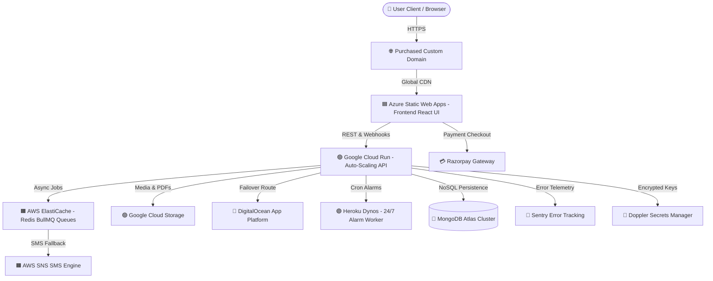
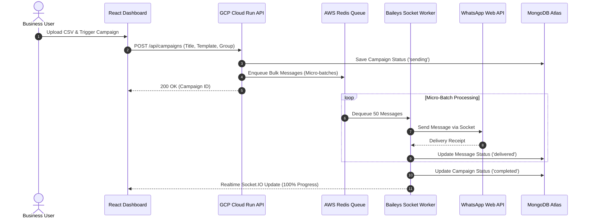
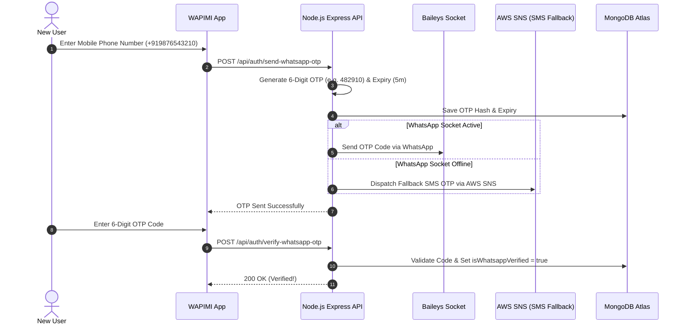

# 🏛️ WAPIMI Multi-Cloud Architecture & Flowcharts

This document describes the enterprise multi-cloud architecture for WAPIMI, utilizing **$1,362 in Cloud Credits** across GCP, Azure, AWS, DigitalOcean, Heroku, and MongoDB Atlas.

---

## 🗺️ System Flowchart Diagram

---

## 🔄 Sequence Flowchart: Bulk Broadcast Execution

---

## 🔐 Sequence Flowchart: WhatsApp 6-Digit OTP Verification

---

## 📊 Cloud Resource Allocation ($1,362 Credits)

| Cloud Provider | Available Credits | Primary Service | Role in WAPIMI System |
| :--- | :--- | :--- | :--- |
| **Google Cloud (GCP)** | **$300** | Cloud Run & GCS | Serverless API auto-scaling (0 -> 1000 instances) + Media Storage |
| **Microsoft Azure** | **$200** | Static Web Apps | Frontend React CDN Edge + Application Insights Monitoring |
| **AWS** | **$200** | ElastiCache & SNS | Redis BullMQ Campaign Queues + SMS OTP Fallback |
| **DigitalOcean** | **$200** | App Platform | Secondary High-Availability API Failover Node |
| **Heroku** | **$312** | Worker Dynos | 24/7 Background Message Schedule & Alarm Execution |
| **MongoDB Atlas** | **$150** | Production Database | Managed NoSQL Mongoose Database Cluster |
