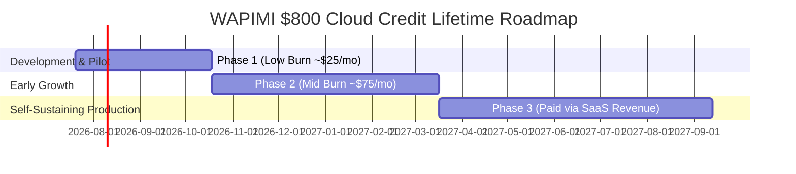

# 📈 WAPIMI Capacity, Credit Lifetime & Growth Projections

This document details the user capacity estimates, message throughput calculations, and credit longevity projections for WAPIMI using **$800 in Cloud Credits** (Azure $200, AWS $200, GCP $300, MongoDB Atlas $100) + Free Tiers.

---

## 🎯 Capacity Projections

| Scale Metric | Phase 1 (0–3 Months) | Phase 2 (4–8 Months) | Phase 3 (9–12+ Months) |
| :--- | :--- | :--- | :--- |
| **Registered Users** | 1,000 | 10,000 | 30,000+ |
| **Active Business Customers** | 20–50 | 100–300 | 500+ |
| **Monthly Messages Processed** | 100,000–500,000 | 1,000,000–5,000,000 | 10,000,000+ |
| **AI Requests (Gemini Flash)** | 10,000–50,000 | 100,000–500,000 | 1,000,000+ |
| **Estimated Credit Burn** | ~$20–$30 / month | ~$60–$90 / month | Credits Expired (Self-Sustaining) |
| **Out-of-Pocket Infrastructure Cost** | **$0** | **$0** | Paid via SaaS Revenue (< 1% of income) |
| **Monthly SaaS Revenue Generated** | $3,000 – $7,500 | $15,000 – $45,000 | $75,000+ |

---

## ⏳ Credit Lifetime Estimation

- **Estimated Credit Longevity**: **8 to 12 Months** of full production operations at zero out-of-pocket cost.
- **Financial Viability**: By Month 6, 100 paying customers on the **Basic Plan ($5/day = $150/mo)** generate **$15,000/month**, easily covering ongoing cloud costs.
