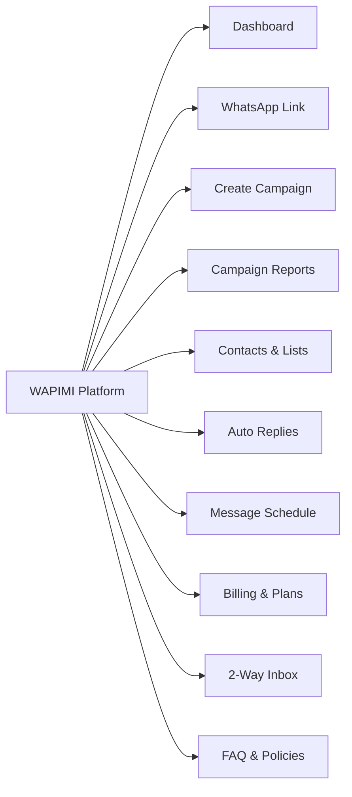

# 📋 WAPIMI Features, Inputs, Outputs & Plans Matrix

This document provides a comprehensive specification of every user interface menu, feature option, input field, expected output, and SaaS plan tier in **WAPIMI**.

---

## 🖥️ Navigation Menus & Interface Options



---

## 📌 Feature Specification, Inputs & Outputs

### 1. Dashboard (`id: "dashboard"`)
- **Menu Option**: Overview metrics & sending velocity graphs.
- **Inputs**: Filter date selector, experience mode switcher (`Daily Starter`, `Professional`, `Advanced Enterprise`).
- **Outputs**: Total messages sent, active campaigns, session uptime status, quick action buttons.

### 2. WhatsApp Link / Scanner (`id: "scanner"`)
- **Menu Option**: Device QR code pairing & status indicator.
- **Inputs**: `Scanned Phone Number` (validation against `allowedWhatsapp`), `Request QR` action trigger.
- **Outputs**: Live QR stream canvas, connection badge (`Active` / `Scan`), session metadata (phone, push name).

### 3. Create Campaign (`id: "campaign_create"`)
- **Menu Option**: Mass WhatsApp broadcast sender.
- **Inputs**: `Campaign Title`, `Target Group Select`, `Message Template` (with `{name}`, `{city}`, `{custom}`), `Interval Delay Slider`, `CSV File Upload`.
- **Outputs**: Realtime progress bar, delivery counters (sent, failed, pending), campaign status badge (`sending`, `paused`, `completed`).

### 4. Message Schedule & Alarm (`id: "birthday"`)
- **Menu Option**: Automated daily message schedule alarm.
- **Inputs**: `Automation Status Toggle` (`Enabled`/`Disabled`), `Automated Execution Hour Select` (`06:00 AM` to `12:00 PM`), `Dynamic Greeting Template`, `Registry Search Filter`.
- **Outputs**: Alarm dispatch activity log, contact birthday registry table, manual sweep trigger (*Run Greetings Sweep Now*).

### 5. Auto Replies (`id: "auto_reply"`)
- **Menu Option**: Rule-based automated incoming message responder.
- **Inputs**: `Trigger Keyword`, `Match Type` (`Exact Match` / `Contains Keyword`), `Reply Content`, `Active Toggle`.
- **Outputs**: Instant automated outbound WhatsApp response when incoming message matches keyword.

### 6. WhatsApp 6-Digit OTP Verification
- **Menu Option**: Mobile number security verification.
- **Inputs**: `Mobile Phone Number` (+91 format), `6-Digit OTP Code`.
- **Outputs**: Outbound WhatsApp OTP message dispatch, account status updated to `isWhatsappVerified: true`.

---

## 💳 SaaS Subscription Plans Breakdown

```
+---------------------------------------------------------------------------------------------------+
| BASIC GROWTH PLAN ($5/day | $30/wk | $100/mo | $1,000/yr)                                          |
| - Limit: 1,000 messages / day                                                                     |
| - Features:                                                                                       |
|   ✓ Rule-based Auto-Replies                                                                       |
|   ✓ Message Scheduling Alarm                                                                      |
|   ✓ CSV Contact Import                                                                            |
|   ✓ Outbound Analytics                                                                            |
+---------------------------------------------------------------------------------------------------+

+---------------------------------------------------------------------------------------------------+
| PREMIUM AUTOMATION SUITE ($15/day | $90/wk | $300/mo | $3,000/yr)                                    |
| - Limit: 10,000 messages / day                                                                    |
| - Features:                                                                                       |
|   ✓ Rule-based Smart Replies                                                                      |
|   ✓ Message Scheduling Alarm                                                                      |
|   ✓ Message Scheduling Dashboard                                                                  |
|   ✓ Advanced Engagement Analytics Charts                                                          |
+---------------------------------------------------------------------------------------------------+

+---------------------------------------------------------------------------------------------------+
| BUSINESS BROADCAST UNLIMITED ($25/day | $150/wk | $500/mo | $5,000/yr)                              |
| - Limit: Unlimited messages / day                                                                 |
| - Features:                                                                                       |
|   ✓ No Sending Limits                                                                             |
|   ✓ Rule-based Auto-Replies with Saved Responses                                                  |
|   ✓ Message Scheduling Running Daily                                                              |
|   ✓ Dedicated Multi-Number Verification                                                           |
+---------------------------------------------------------------------------------------------------+
```
