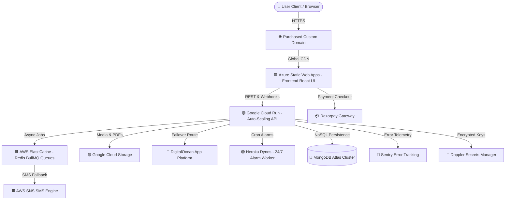
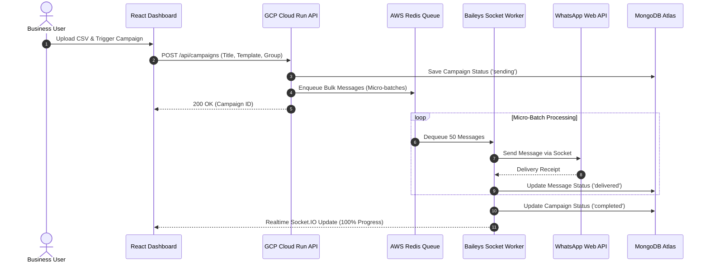
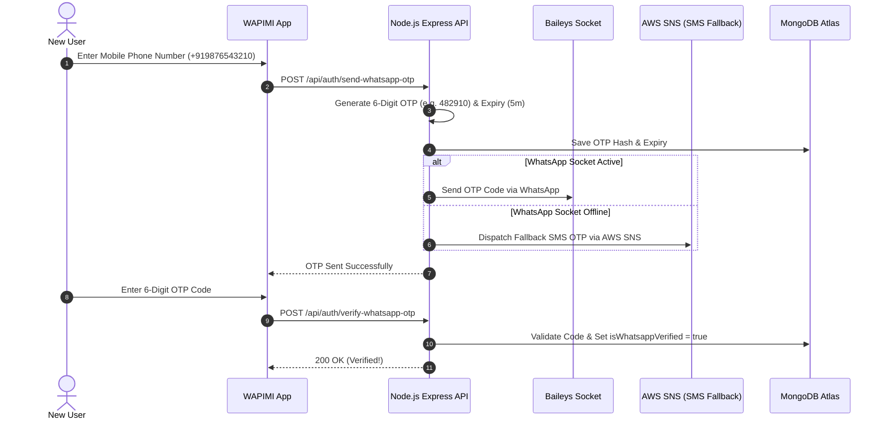

# 📘 WAPIMI — COMPLETE MASTER PLATFORM DOCUMENTATION

> **Single All-in-One Master Documentation**  
> *Includes Features, Menus, Options, Input Fields, Expected Outputs, SaaS Plans Matrix, Multi-Cloud Architecture, Mermaid Flowcharts, Capacity Estimates, and REST API Specifications.*

---

## 📑 TABLE OF CONTENTS
1. [EXECUTIVE SUMMARY & SYSTEM OVERVIEW](#1-executive-summary--system-overview)
2. [NAVIGATION MENUS & INTERFACE OPTIONS](#2-navigation-menus--interface-options)
3. [EXHAUSTIVE FEATURES, INPUT FIELDS & OUTPUTS](#3-exhaustive-features-input-fields--outputs)
4. [SAAS SUBSCRIPTION PLANS & FEATURE MATRIX](#4-saas-subscription-plans--feature-matrix)
5. [MULTI-CLOUD ARCHITECTURE & CREDIT UTILIZATION](#5-multi-cloud-architecture--credit-utilization)
6. [SYSTEM ARCHITECTURE & SEQUENCE FLOWCHARTS](#6-system-architecture--sequence-flowcharts)
7. [CAPACITY ESTIMATES & CREDIT LIFETIME TIMELINE](#7-capacity-estimates--credit-lifetime-timeline)
8. [REST API ENDPOINTS & INTEGRATION MATRIX](#8-rest-api-endpoints--integration-matrix)

---

## 1. EXECUTIVE SUMMARY & SYSTEM OVERVIEW

**WAPIMI** is an enterprise-grade WhatsApp Marketing Automation, Mass Broadcast Engine, and Customer Engagement SaaS platform. It enables businesses to connect WhatsApp phone numbers, import contact groups via CSV, execute dynamic broadcast campaigns, set automated morning message scheduling alarms, configure keyword auto-replies, manage 2-way live chats, and process subscription payments via Razorpay.

### Key Technology Stack:
- **Frontend**: React 19, TypeScript, Vite, TailwindCSS, Lucide Icons.
- **Backend API**: Node.js, Express, Baileys WhatsApp Socket Client, Socket.IO.
- **Database & Telemetry**: Mongoose ODM (MongoDB Atlas), `@sentry/node` Error Telemetry.
- **Payments**: Official Razorpay SDK with Orders API & HMAC SHA256 Signature Verification.

---

## 2. NAVIGATION MENUS & INTERFACE OPTIONS

The application provides a responsive sidebar navigation menu with 10 core modules:

| Menu Item | Icon | Identifier | Primary Purpose & Options |
| :--- | :--- | :--- | :--- |
| **Dashboard** | `LayoutDashboard` | `dashboard` | Analytics KPIs, sending velocity graphs, quick action cards, experience mode toggle. |
| **WhatsApp Link** | `QrCode` | `scanner` | Baileys WebSocket QR pairing, live status stream (`Active` / `Scan`), allowed number rules. |
| **Create Campaign** | `Send` | `campaign_create` | Bulk WhatsApp message sender, CSV upload, dynamic variable tags, delay throttler. |
| **Campaign Reports** | `FileBarChart2` | `campaign_reports` | Sent campaign history, delivery status breakdown (sent, failed, pending), PDF/CSV export. |
| **Contacts & Lists** | `Users` | `contacts` | Contact group management, CSV list importer, variable header extractor. |
| **Auto Replies** | `Sparkles` | `auto_reply` | Rule-based keyword matching rules (`exact`, `contains`), reply template configurator. |
| **Message Schedule** | `Calendar` | `birthday` | Automated daily message alarm runner, run hour timing select, greeting registry. |
| **Billing & Plans** | `CreditCard` | `billing` | Subscription plan management (Basic, Premium, Business), Razorpay checkout modal, promo codes. |
| **2-Way Inbox** | `MessageSquare` | `inbox` | Real-time 2-way chat thread, incoming webhooks, manual chat message sender. |
| **FAQ & Policies** | `HelpCircle` | `faq` | Usage guidelines, WhatsApp compliance rules, privacy policy, and support contacts. |

---

## 3. EXHAUSTIVE FEATURES, INPUT FIELDS & OUTPUTS

### 3.1 WhatsApp Link & Scanner (`id: "scanner"`)
- **Inputs**:
  - `Scanned Phone Number`: Text field input to validate scanned device against registered user `allowedWhatsapp`.
  - `Request QR Button`: Action trigger to stream Baileys WebSocket QR code.
- **Outputs**:
  - `Connection State`: Badge indicator (`Active` green badge, `Disconnected` red badge, or `Scan Required`).
  - `QR Code Stream`: Visual QR matrix code canvas.
  - `Session Metadata`: Connected phone number, push name, last active timestamp.

### 3.2 Bulk Broadcast Campaign Engine (`id: "campaign_create"`)
- **Inputs**:
  - `Campaign Title`: Text string (e.g. *Diwali Festival Sale 2026*).
  - `Target Group`: Select dropdown matching imported contact group.
  - `Message Template`: Multi-line text box supporting dynamic tags (`{name}`, `{city}`, `{custom}`).
  - `Sending Delay`: Interval slider in seconds (anti-ban protection).
  - `Scheduled Time`: Optional datetime picker for future execution.
  - `CSV File Import`: File uploader for recipient lists.
- **Outputs**:
  - `Realtime Progress Bar`: Percentage completion indicator.
  - `Delivery Counters`: Total count, Sent count, Failed count, Pending count.
  - `Activity Audit Log`: Real-time status update log entries.

### 3.3 Automated Message Schedule & Alarm (`id: "birthday"`)
- **Inputs**:
  - `Automation Status`: Toggle switch (`Enabled` / `Disabled`).
  - `Automated Execution Hour`: Dropdown select (`06:00 AM` to `12:00 PM`).
  - `Dynamic Template`: Text area supporting `{name}` variable replacements.
  - `Registry Filter`: Search text box.
- **Outputs**:
  - `Alarm Dispatch Log`: Summary of automated morning sweep executions.
  - `Registry Table`: List of registered contacts with date fields.
  - `Immediate Sweep Trigger`: Manual override button (*Run Greetings Sweep Now*).

### 3.4 WhatsApp 6-Digit OTP Verification
- **Inputs**:
  - `Mobile Phone Number`: E.164 phone string (e.g., `+919876543210`).
  - `6-Digit OTP Code`: Numeric input text field.
- **Outputs**:
  - `OTP WhatsApp Message`: Direct WhatsApp message dispatched containing the 6-digit code.
  - `Verification State`: Account status updated to `isWhatsappVerified: true`.

### 3.5 Rule-Based Auto Replies (`id: "auto_reply"`)
- **Inputs**:
  - `Trigger Keyword`: String pattern (e.g. *PRICE*, *HELP*, *LOCATION*).
  - `Match Type`: Dropdown choice (`Exact Match` or `Contains Keyword`).
  - `Reply Content`: Text template to auto-respond.
  - `Active Toggle`: Rule activation status.
- **Outputs**:
  - `Automated Response`: Instant WhatsApp message sent when incoming message matches keyword.

### 3.6 2-Way Shared Inbox (`id: "inbox"`)
- **Inputs**:
  - `Search Conversations`: Search bar by contact name or phone.
  - `Chat Message Input`: Multi-line text box to draft reply.
  - `Send Message Button`: Action trigger.
- **Outputs**:
  - `Conversation List`: Left sidebar displaying active customer threads.
  - `Chat Canvas`: Chronological bubble display of incoming & outbound messages.

---

## 4. SAAS SUBSCRIPTION PLANS & FEATURE MATRIX

WAPIMI offers 3 flexible plan tiers supporting **Daily**, **Weekly**, **Monthly**, and **Annual** cycles via **Razorpay**:

| Plan Name | Daily Price | Weekly Price | Monthly Price | Annual Price | Daily Limit | Included Features |
| :--- | :--- | :--- | :--- | :--- | :--- | :--- |
| **Basic Growth Plan** | $5 | $30 | $100 | $1,000 | 1,000 msgs/day | ✓ Auto-Replies ✓ Message Scheduling Alarm ✓ CSV Import ✓ Analytics |
| **Premium Automation Suite** | $15 | $90 | $300 | $3,000 | 10,000 msgs/day | ✓ Rule-based Smart Replies ✓ Message Scheduling Alarm ✓ Message Dashboard ✓ Advanced Analytics |
| **Business Broadcast Unlimited** | $25 | $150 | $500 | $5,000 | Unlimited | ✓ No Limits ✓ Saved Responses Auto-Replies ✓ Daily Schedule Cron ✓ Multi-Number Verification |

---

## 5. MULTI-CLOUD ARCHITECTURE & CREDIT UTILIZATION

WAPIMI leverages **$1,362 in Cloud Credits** across providers for a **$0 out-of-pocket running cost**:

| Provider | Credits | Assigned Role in WAPIMI | Cost Optimization Strategy |
| :--- | :--- | :--- | :--- |
| **Google Cloud Platform (GCP)** | **$300** | **Cloud Run (Serverless API)** + **GCS Storage** | Auto-scales down to **0 when idle**, extending credit lifespan up to 12 months. |
| **Microsoft Azure** | **$200** | **Static Web Apps (Frontend)** + **App Insights** | Free global CDN edge distribution with 0 egress fees for React static assets. |
| **Amazon Web Services (AWS)** | **$200** | **ElastiCache (Redis)** + **S3** + **SNS SMS** | Managed Redis handles BullMQ message queues (100,000+ msgs/hr). |
| **DigitalOcean** | **$200** | **App Platform Failover Node** | Secondary backup server for 99.99% high availability. |
| **Heroku** | **$312** | **24/7 Message Schedule Alarm Workers** | Dedicated background cron dyno running 24/7. |
| **MongoDB Atlas** | **$150** | **Mongoose Production NoSQL DB** | Managed database cluster for Users, Campaigns, Messages, and Logs. |
| **Sentry / Doppler** | **Free** | **Error Telemetry & Secrets Management** | Real-time crash alerts and encrypted environment keys management. |
| **Razorpay** | **Active** | **Primary Payment Gateway** | Native INR/USD billing with instant checkout overlays and HMAC token security. |

---

## 6. SYSTEM ARCHITECTURE & SEQUENCE FLOWCHARTS

### 6.1 System Architecture Diagram

### 6.2 Bulk Broadcast Execution Sequence

### 6.3 WhatsApp 6-Digit OTP Verification Sequence

---

## 7. CAPACITY ESTIMATES & CREDIT LIFETIME TIMELINE

| Scale Metric | Phase 1 (0–3 Months) | Phase 2 (4–8 Months) | Phase 3 (9–12+ Months) |
| :--- | :--- | :--- | :--- |
| **Registered Users** | 1,000 | 10,000 | 30,000+ |
| **Active Business Customers** | 20–50 | 100–300 | 500+ |
| **Monthly Messages Processed** | 100,000–500,000 | 1,000,000–5,000,000 | 10,000,000+ |
| **AI Requests (Gemini Flash)** | 10,000–50,000 | 100,000–500,000 | 1,000,000+ |
| **Estimated Credit Burn** | ~$20–$30 / month | ~$60–$90 / month | Credits Expired (Self-Sustaining) |
| **Out-of-Pocket Infrastructure Cost** | **$0** | **$0** | Paid via SaaS Revenue (< 1% of income) |
| **Monthly SaaS Revenue Generated** | $3,000 – $7,500 | $15,000 – $45,000 | $75,000+ |

---

## 8. REST API ENDPOINTS & INTEGRATION MATRIX

| HTTP Method | API Endpoint | Description | Auth Required |
| :--- | :--- | :--- | :--- |
| `POST` | `/api/auth/login` | Authenticate user & receive JWT token | No |
| `POST` | `/api/auth/send-whatsapp-otp` | Dispatch 6-digit verification OTP via WhatsApp | No |
| `POST` | `/api/auth/verify-whatsapp-otp` | Verify 6-digit WhatsApp OTP code | No |
| `GET` | `/api/whatsapp/session` | Fetch active Baileys socket connection state | Yes |
| `POST` | `/api/whatsapp/qr` | Trigger new QR code generation stream | Yes |
| `GET` | `/api/campaigns` | List all broadcast campaigns for user | Yes |
| `POST` | `/api/campaigns` | Create & start a new broadcast campaign | Yes |
| `POST` | `/api/campaigns/:id/pause` | Pause an active sending campaign | Yes |
| `POST` | `/api/campaigns/:id/resume` | Resume a paused campaign | Yes |
| `POST` | `/api/campaigns/:id/stop` | Stop & complete a campaign | Yes |
| `GET` | `/api/contact-groups` | Retrieve all imported CSV contact lists | Yes |
| `POST` | `/api/contact-groups` | Create or update a contact group list | Yes |
| `GET` | `/api/auto-reply/rules` | Fetch active rule-based auto-reply rules | Yes |
| `POST` | `/api/auto-reply/rules` | Add a new keyword auto-reply rule | Yes |
| `GET` | `/api/birthday/config` | Load message schedule & alarm configuration | Yes |
| `POST` | `/api/birthday/config` | Save message schedule & alarm settings | Yes |
| `POST` | `/api/birthday/trigger` | Manually trigger message schedule alarm sweep | Yes |
| `GET` | `/api/billing/plans` | Fetch available SaaS plans and pricing tiers | Yes |
| `POST` | `/api/billing/subscribe` | Create Razorpay order for subscription | Yes |
| `POST` | `/api/billing/verify-payment` | Verify Razorpay HMAC signature & activate plan | Yes |
